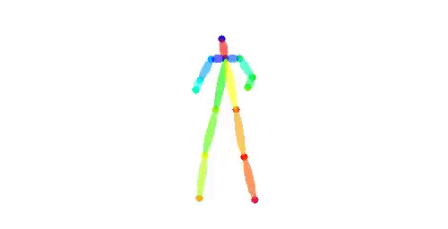
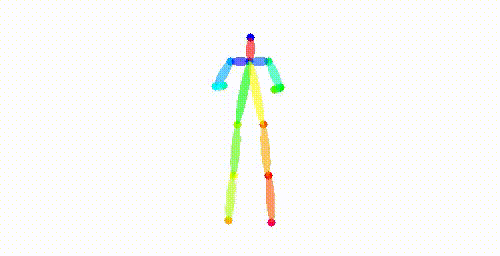
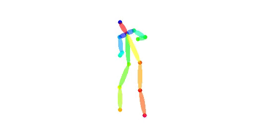
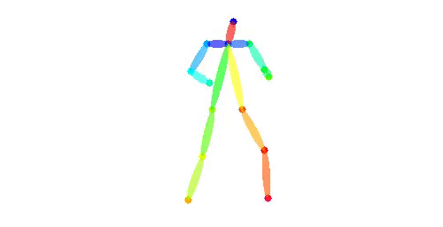
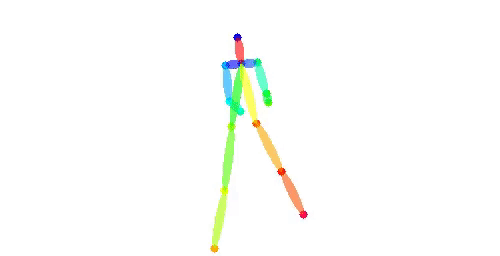
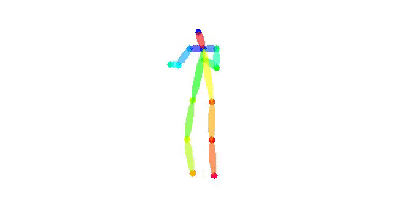
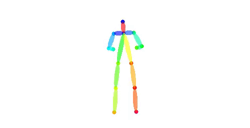
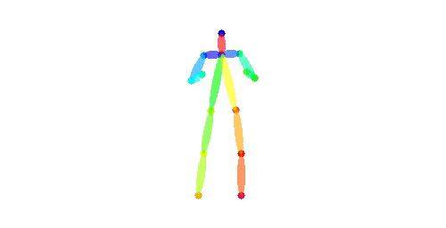
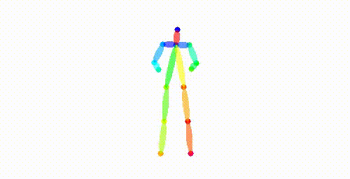
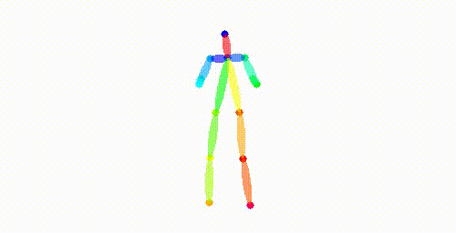

## Dancing to Music - CIS 565 Final Project
### Han Yan, Weiyu Du

### Introduction
Dancing to a piece of music is an instinct move by humans. However, learning to model the music-to-dance generation process is quite a challenging task for machine learning models. First of all, many factors need to be taken into consideration in the music-dance correlation; Secondly, dance is multimodal -- we could have several dances that are equally beautiful mapped to one piece of music. 

In this final project, we took on this challenging task and explored one state-of-the-art work on this topic: the Dancing to Music paper by Lee et al., published at Neurips 2019. In training and testing our models, we found the method did not perform as well as we had been led to believe. We analyzed its performance both in terms of time efficency and in terms of effectiveness of each individual module and loss. Based on the conclusion we derived, we proposed a few modifications to the method and showed some improvements in visual results.

### Final Presentation
Based on the conclusion we had from last milestone's analysis,
1) We improved model architecture for the Music Style Extractor: First of all, the paper used a hidden size of 30, 1 layer for RNN. We increased this to hidden size of 512, 2 layers to increase model capacity. To retain the dimension of the original latent space, we added another linear layer to map the channels from 512 to 30. Moreover, we added two dropout layers in the classifier to help regularize the network. We also modified the data processing pipeline to take advantage of longer audio signals.

The paper did not provide details about how they trained the Music Style Extractor, so we built our own training pipeline. After 100 epochs, we found our accuracy to be **98.7%** ，which is a significant improvement from the original **73.5%** . We have reason to believe this provides better music style feature, thus better dance generation quality.

2) We also trained a new model only on Ballet dances to verify, if, aside from the confusion about types of music, the model can capture typical ballet movements.

| Improved Model          |  Original Model |
:-------------------------:|:-------------------------:
 | 

### Milestone 3 - Model Drilldown

#### Evaluation on Music Style Classification
  
Overall accuracy: **73.5%**
|  | Ballet | Zumba | Hiphop |
| ------ | ------ | ----- | ------ |
| Precision | 89.8% | 71.9% | 52.6% |
| Predicted as Ballet | N/A | 4.8% | 36.8% |
| Predicted as Zumba | 4.3% | N/A | 10.4% |
| Predicted as Hiphop | 5.8% | 23.2% | N/A |

#### Evaluation on Impact of Initial Pose

We take Gaussian distributions on the initial pose:
| sample 1 | sample 2 | sample 3 | sample 4 |
:------:|:------:|:------:|:------:
 |  |  | 

#### Ablation Studies 

* Alignment of latent dance codes 
* Alignment between music and dance style
* Alignment of latent dance movements

| Model without style regressor           |  Full Model |
:-------------------------:|:-------------------------:
 | 

### Conclusion
Music Style Extractor performs surprisingly poor on style classification task, which means 1) the model fails to understand what dance style it should generate 2) music feature is very poor. Combining with the lack of significant visual difference in the generation results of our ablation studies, we conclude music style understanding is the most evident bottleneck for our dancing to music task.

### Milestone 2 - Performance Analysis on CPU vs GPU with varying batch size

#### Training time: forward and backward network pass

| CPU training time           |  GPU training time |
:-------------------------:|:-------------------------:
 | 

#### Training time: data loading

#### Inference time:

#### Model architecture: LSTM vs. GRU

### Milestone 1 - Code Refinement, Model Training and Visualization

#### Training

| ballet | hiphop |
:------:|:------:
 | 

#### Inference result

Generated dance using music in Sylvia - Act 3 solo piece

For reference, here's a link to real person performance: https://www.youtube.com/watch?v=We7KAkWJow8

### Links to Presentations
 Milestone 1: https://docs.google.com/presentation/d/11YTHrU7iGCIOVsd0SLnEJZcHaSJD--XU_pph3FcJ-fk/edit?usp=sharing 
 Milestone 2: https://docs.google.com/presentation/d/1MyYJxO-48K1sjDSLLNfdr59GFTHjvSDZCJRkToGwey4/edit?usp=sharing 
 Milestone 3: https://docs.google.com/presentation/d/1OBWptq5f9bYVLz_lLq-whvNVv35XpLIs4e05uK2CO7g/edit?usp=sharing 
