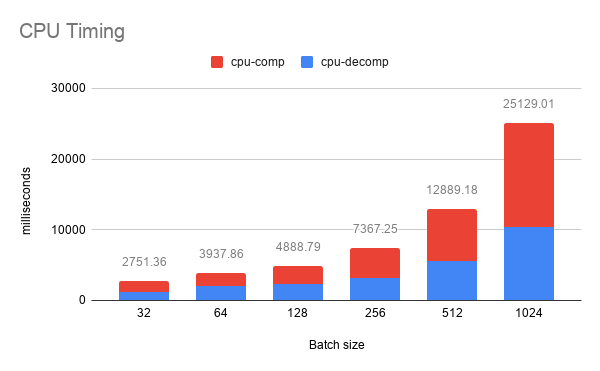
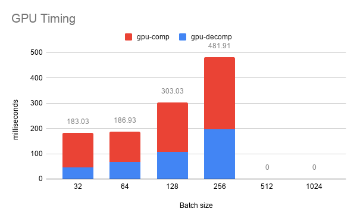
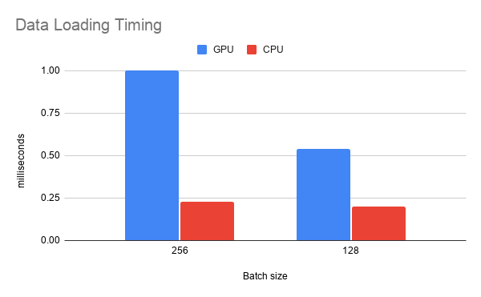
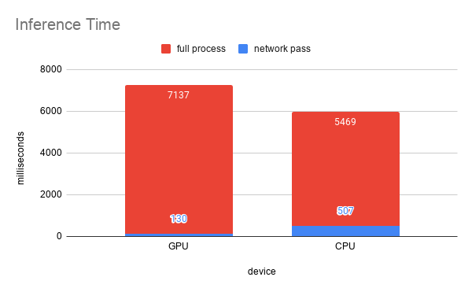
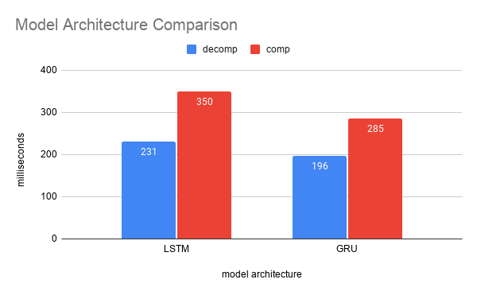

## Dancing to Music - CIS 565 Final Project
### Han Yan, Weiyu Du

### Milestone 3 - Model Drilldown

#### Evaluation on Music Style Classification
  
|  | Ballet | Zumba | Hiphop |
| ------ | ------ | ----- | ------ |
| Precision | 89.8% | 71.9% | 52.6% |
| Predicted as Ballet | N/A | 4.8% | 36.8% |
| Predicted as Zumba | 4.3% | N/A | 10.4% |
| Predicted as Hiphop | 5.8% | 23.2% | N/A |

#### Evaluation on Impact of Initial Pose

#### Ablation Studies 

* Alignment of latent dance codes 
* Alignment between music and dance style
* Alignment of latent dance movements

### Milestone 2 - Performance Analysis on CPU vs GPU with varying batch size

#### Training time: forward and backward network pass

| CPU training time           |  GPU training time |
:-------------------------:|:-------------------------:
 | 

#### Training time: data loading

#### Inference time:

#### Model architecture: LSTM vs. GRU

### Milestone 1 - Code Refinement, Model Training and Visualization

#### Training

#### Inference result

### Links to Presentations
Milestone 1: https://docs.google.com/presentation/d/11YTHrU7iGCIOVsd0SLnEJZcHaSJD--XU_pph3FcJ-fk/edit?usp=sharing
Milestone 2: https://docs.google.com/presentation/d/1MyYJxO-48K1sjDSLLNfdr59GFTHjvSDZCJRkToGwey4/edit?usp=sharing
Milestone 3: https://docs.google.com/presentation/d/1OBWptq5f9bYVLz_lLq-whvNVv35XpLIs4e05uK2CO7g/edit?usp=sharing
